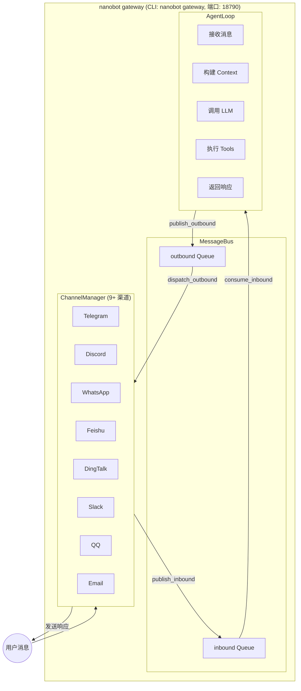
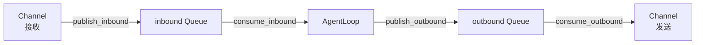
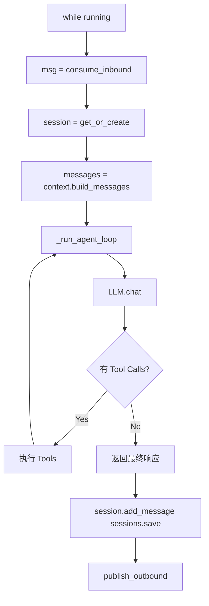
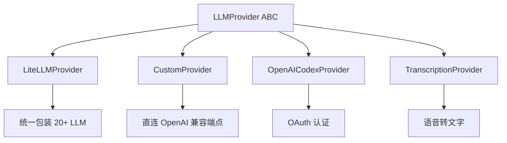
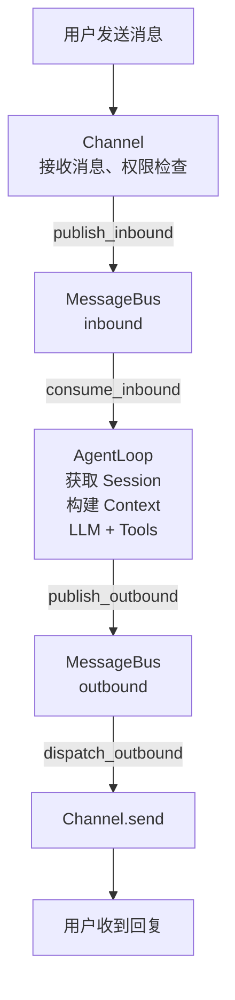

# 🏗️ nanobot 项目架构详细分析

> 生成时间: 2026-02-22
> 作者: 小诺 (Xiao Nuo)

---

## 一、整体架构概览

nanobot 采用 **事件驱动 + 消息总线** 的架构模式，核心是一个异步消息队列解耦消息收发双方。



---

## 二、核心模块详解

### 1. 消息总线 (Message Bus) 🔌

**位置**: `nanobot/bus/`

```python
# 消息类型定义
InboundMessage  ──────┐
  - channel: str     │    # 来自哪个渠道 (telegram, discord, feishu...)
  - sender_id: str   │    # 发送者 ID
  - chat_id: str     │    # 会话 ID
  - content: str     │
  - media: list      │    # 图片/文件
  - metadata: dict   ┘

OutboundMessage ─────┐
  - channel: str    │
  - chat_id: str    │
  - content: str    │
  - media: list     ┘
```

**消息流**:


---

### 2. 渠道层 (Channels) 📱

**位置**: `nanobot/channels/`

| 渠道 | 文件 | 状态 | 说明 |
|------|------|------|------|
| Telegram | `telegram.py` | ✅ | Bot API |
| Discord | `discord.py` | ✅ | Gateway API |
| WhatsApp | `whatsapp.py` | ✅ | 需桥接服务 |
| 飞书 | `feishu.py` | ✅ | WebSocket 长连接 |
| 钉钉 | `dingtalk.py` | ✅ | Stream 模式 |
| Slack | `slack.py` | ✅ | Socket 模式 |
| QQ | `qq.py` | ✅ | botpy SDK |
| Email | `email.py` | ✅ | IMAP + SMTP |
| MoChat | `mochat.py` | ✅ | 企业微信方案 |

**每个渠道需实现**:
```python
class BaseChannel(ABC):
    async def start() -> None      # 启动监听
    async def stop() -> None        # 停止
    async def send(msg) -> None     # 发送消息
    def is_allowed(sender_id) -> bool  # 权限检查
```

---

### 3. Agent 核心 (Agent Loop) 🧠

**位置**: `nanobot/agent/loop.py` (约 418 行)

```
┌─────────────────────────────────────────────────────────────┐
│                    AgentLoop.run() 流程                      │
├─────────────────────────────────────────────────────────────┤
│                                                             │
│   while running:                                            │
│     1. msg = await bus.consume_inbound()                   │
│        │                                                    │
│        ▼                                                    │
│     2. session = sessions.get_or_create(session_key)        │
│        │                                                    │
│        ▼                                                    │
│     3. messages = context.build_messages(                  │
│           history=session.get_history(),                   │
│           current_message=msg.content                      │
│        )                                                    │
│        │                                                    │
│        ▼                                                    │
│     4. _run_agent_loop(messages)                           │
│        │                                                    │
│        ├─▶ LLM.chat() ──▶ 响应                              │
│        │         │                                          │
│        │         ▼                                          │
│        │    有 Tool Calls?                                   │
│        │       ├─ Yes ──▶ 执行 Tools ──▶ 添加结果 ──▶ 继续 │
│        │       │                                            │
│        │       └─ No ──▶ 返回最终响应                        │
│        │                                                    │
│        ▼                                                    │
│     5. session.add_message(user, msg.content)              │
│        session.add_message(assistant, response)             │
│        sessions.save(session)                               │
│        │                                                    │
│        ▼                                                    │
│     6. await bus.publish_outbound(response)                │
│                                                             │
└─────────────────────────────────────────────────────────────┘
```

替换为:



---

### 4. 上下文构建 (Context Builder) 📝

**位置**: `nanobot/agent/context.py`

构建给 LLM 的完整 prompt：

```python
system_prompt = """
# 1. 基本描述 (内置)
   - 当前时间、运行环境、工作空间
   - 可用工具列表

# 2. Bootstrap 文件 (workspace/)
   - SOUL.md - AI 人格设定
   - USER.md - 用户信息

# 3. 长期记忆 (memory/)
   - MEMORY.md - 跨会话持久化的重要信息

# 4. 技能 (skills/)
   - 已加载的技能 (完整内容)
   - 可用技能 (仅摘要，需主动读取)

# 5. 当前会话信息
   - Channel: feishu
   - Chat ID: oc_xxx
"""
```

---

### 5. 记忆系统 (Memory) 🧬

**位置**: `nanobot/agent/memory.py`

```
┌─────────────────────────────────────────────────────┐
│              双层记忆系统                             │
├─────────────────────────────────────────────────────┤
│                                                     │
│  Layer 1: MEMORY.md (长期记忆)                      │
│  - LLM 总结的重要事实、偏好、笔记                     │
│  - grep 友好，可被直接读取                            │
│                                                     │
│  Layer 2: HISTORY.md (历史记录)                      │
│  - 按时间排列的事件日志                              │
│  - 格式: [YYYY-MM-DD HH:MM] 事件描述                │
│  - 可用 grep 搜索                                    │
│                                                     │
│  机制:                                              │
│  - 每隔 memory_window (50) 条消息触发合并            │
│  - LLM 调用 save_memory 工具进行总结                 │
│  - 旧消息归档到 HISTORY，核心信息写入 MEMORY         │
│                                                     │
└─────────────────────────────────────────────────────┘
```

---

### 6. 工具系统 (Tools) 🔧

**位置**: `nanobot/agent/tools/`

| 工具 | 功能 | 依赖 |
|------|------|------|
| `web` | 网络搜索和网页获取 (Tavily) | tavily, httpx, readability |
| `shell` | 执行 Shell 命令 | - |
| `spawn` | 生成子代理 | - |
| `mcp` | MCP 工具调用 | mcp 库 |
| `cron` | 定时任务 | - |
| `filesystem` | 文件操作 | - |

**工具注册流程**:
```python
# agent/loop.py 初始化时
tools = ToolRegistry()
tools.register(WebSearchTool(api_key=...))
tools.register(WebFetchTool())
tools.register(ShellTool(timeout=60))
tools.register(SpawnTool())
tools.register(CronTool())
tools.register(MCPTools(servers=...))
```

---

### 7. LLM 提供商 (Providers) 🤖

**位置**: `nanobot/providers/`



**支持的 LLM 提供商** (via LiteLLM):
- **标准**: OpenAI, Anthropic, DeepSeek, Gemini
- **国内**: DashScope (通义千问), Moonshot (月之暗面), MiniMax, Zhipu (智谱)
- **网关**: OpenRouter, AiHubMix, SiliconFlow, VolcEngine (火山引擎)
- **本地**: vLLM, Ollama

---

### 8. 会话管理 (Session) 💬

**位置**: `nanobot/session/manager.py`

```python
# 会话结构
Session:
  key: str           # "channel:chat_id" 如 "telegram:123456"
  messages: list     # 消息列表 (role, content, timestamp, tools_used)
  created_at: datetime
  updated_at: datetime
  metadata: dict
  last_consolidated: int  # 已合并的消息数

# 存储格式: JSONL
# ~/.nanobot/workspace/sessions/telegram_123456.jsonl
```

---

### 9. 定时任务 (Cron) ⏰

**位置**: `nanobot/cron/service.py`

```python
# 支持的调度方式
- every N 秒 (every_ms)
- Cron 表达式 (expr + timezone)
- 一次性执行 (at_ms)

# 示例
nanobot cron add -n "AI新闻" -m "搜集今日AI热点" --cron "0 13 * * *" --tz Asia/Shanghai

# 定时任务类型
- 消息触发 (agent_turn)
- 可选投递到渠道 (deliver=true --to=xxx --channel=telegram)
```

---

### 10. 配置系统 (Config) ⚙️

**位置**: `nanobot/config/schema.py`

使用 Pydantic + pydantic-settings:

```python
Config:
  ├── agents: AgentsConfig
  │     └── defaults: model, max_tokens, temperature, memory_window
  │
  ├── channels: ChannelsConfig
  │     ├── telegram, discord, whatsapp
  │     ├── feishu, dingtalk, slack
  │     ├── qq, email, mochat
  │
  ├── providers: ProvidersConfig
  │     ├── openai, anthropic, deepseek
  │     ├── dashscope, moonshot, minimax, zhipu
  │     ├── openrouter, siliconflow, volcengine
  │     └── vllm (本地)
  │
  ├── gateway: host, port
  │
  └── tools: ToolsConfig
        ├── web.search (tavily)
        ├── exec (shell timeout)
        └── mcp_servers (dict)
```

**配置加载优先级**:
1. 环境变量 (`NANOBOT_xxx`)
2. `~/.nanobot/config.json`
3. 默认值

---

## 三、数据流全景图



---

## 四、扩展开发指南

### 新增一个渠道 (以 Slack 为例)

```python
# 1. 在 channels/ 下创建 slack.py
from nanobot.channels.base import BaseChannel
from nanobot.bus.events import OutboundMessage

class SlackChannel(BaseChannel):
    name = "slack"
    
    async def start(self):
        # 连接 Slack WebSocket 或注册 Webhook
        pass
    
    async def stop(self):
        # 断开连接
        pass
    
    async def send(self, msg: OutboundMessage):
        # 发送消息到 Slack
        pass

# 2. 在 channels/manager.py 注册
if self.config.channels.slack.enabled:
    from nanobot.channels.slack import SlackChannel
    self.channels["slack"] = SlackChannel(...)
```

### 新增一个工具

```python
# 在 agent/tools/ 下创建 mytool.py
from nanobot.agent.tools.base import Tool

class MyTool(Tool):
    name = "my_tool"
    description = "工具描述"
    parameters = {
        "type": "object",
        "properties": {
            "param1": {"type": "string"}
        },
        "required": ["param1"]
    }
    
    async def execute(self, param1: str, **kwargs) -> str:
        # 工具逻辑
        return f"Result: {param1}"

# 在 agent/loop.py 注册
tools.register(MyTool())
```

---

## 五、关键技术亮点

| 特性 | 实现方式 | 价值 |
|------|----------|------|
| **消息解耦** | asyncio.Queue | 渠道和 Agent 独立演进 |
| **多渠道统一** | BaseChannel 抽象 | 5 分钟接入新渠道 |
| **多 LLM 支持** | LiteLLM 统一包装 | 切换模型无感知 |
| **记忆持久化** | MEMORY.md + HISTORY.md | 长期记忆不丢失 |
| **工具生态** | 动态注册 + MCP | 扩展能力无限 |
| **定时任务** | 内置 Cron 服务 | 自动化工作流 |

---

## 六、代码规模

- **核心代码**: ~2000 行 (不含渠道和测试)
- **Agent 核心** (`loop.py`): ~418 行
- **上下文构建** (`context.py`): ~239 行
- **渠道管理** (`manager.py`): ~227 行
- **会话管理** (`session/manager.py`): ~200 行
- **记忆系统** (`memory.py`): ~138 行
- **支持渠道**: 9 个
- **支持 LLM**: 15+

---

## 七、目录结构总览

```
nanobot/
├── agent/                 # Agent 核心
│   ├── loop.py           # 主循环 (~418行)
│   ├── context.py        # 上下文构建
│   ├── memory.py         # 记忆系统
│   ├── skills.py         # 技能加载器
│   ├── subagent.py       # 后台任务执行
│   ├── tools/            # 工具集
│   │   ├── base.py
│   │   ├── web.py        # 网络搜索和网页获取
│   │   ├── shell.py
│   │   ├── spawn.py
│   │   ├── cron.py
│   │   ├── filesystem.py
│   │   ├── mcp.py
│   │   └── registry.py   # 工具注册表
│
│
├── channels/             # 渠道实现
│   ├── base.py          # BaseChannel 抽象
│   ├── manager.py       # 渠道管理 (~227行)
│   ├── telegram.py
│   ├── discord.py
│   ├── feishu.py
│   ├── dingtalk.py
│   ├── slack.py
│   ├── whatsapp.py
│   ├── qq.py
│   ├── email.py
│   └── mochat.py
│
├── bus/                  # 消息总线
│   ├── events.py        # 消息类型定义
│   └── queue.py         # asyncio.Queue 封装
│
├── providers/           # LLM 提供商
│   ├── base.py          # Provider 抽象
│   ├── litellm_provider.py  # LiteLLM 包装
│   ├── custom_provider.py   # 自定义端点
│   ├── openai_codex_provider.py  # OAuth 认证
│   ├── transcription.py     # 语音转文字
│   └── registry.py      # 模型->提供商映射
│
├── session/             # 会话管理
│   └── manager.py      # SessionManager (~200行)
│
├── config/              # 配置系统
│   ├── schema.py       # Pydantic 模型
│   └── loader.py       # 配置加载逻辑
│
├── cron/                # 定时任务
│   ├── service.py      # Cron 服务
│   └── types.py        # 任务类型定义
│
├── heartbeat/           # 主动唤醒事件
│   └── service.py      # 心跳服务
│
├── commands/            # CLI 命令
│   └── commands.py     # 使用 typer 构建的 CLI
│
├── skills/              # 捆绑的技能
│   └── skill-creator/
│
my_skills/               # 用户自定义技能
│   └── ai-news-fetcher/
│
└── utils/               # 工具函数
    └── helpers.py      # 辅助函数
```

---

*文档持续更新中...*
