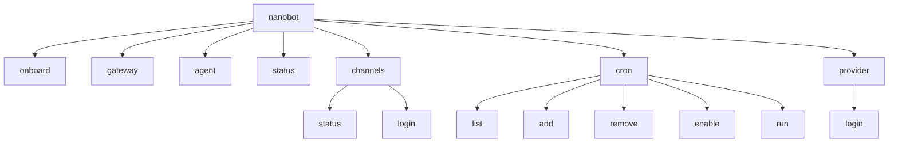
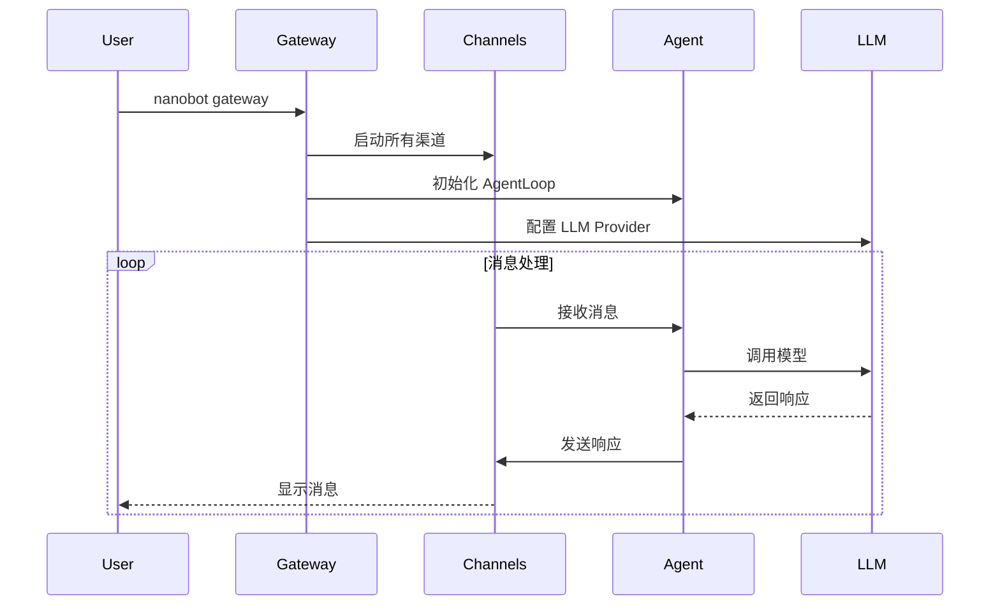
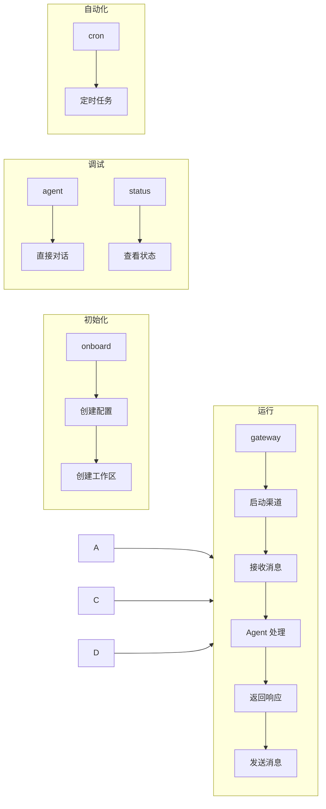

# Nanobot CLI 命令参考

本文档详细介绍 nanobot 项目支持的所有 CLI 命令。

## 命令概览



## 常用命令

### 1. 初始化配置

```bash
nanobot onboard
```

初始化 nanobot 配置和工作区。执行以下操作：

- 创建配置文件 `~/.nanobot/config.json`
- 创建工作目录 `~/.nanobot/workspace/`
- 创建默认模板文件：
  - `SOUL.md` - Agent 灵魂/人格定义
  - `USER.md` - 用户信息
  - `memory/MEMORY.md` - 长期记忆
  - `memory/HISTORY.md` - 对话历史

**首次使用必须运行此命令！**

---

### 2. 启动网关

```bash
nanobot gateway              # 默认端口 18790
nanobot gateway -p 8080      # 指定端口
nanobot gateway --verbose    # 启用调试日志
```

启动 nanobot 网关服务，连接所有配置的聊天渠道。

**流程图：**



启动的组件：
- **MessageBus** - 消息总线
- **AgentLoop** - 核心 Agent 引擎
- **ChannelManager** - 渠道管理器
- **SessionManager** - 会话管理器
- **CronService** - 定时任务服务
- **HeartbeatService** - 心跳服务（每 30 分钟唤醒一次）

---

### 3. 与 Agent 对话

#### 单次对话

```bash
nanobot agent -m "你好，请介绍一下自己"
```

#### 交互式对话模式

```bash
nanobot agent
```

支持选项：
- `-m, --message TEXT` - 发送单条消息
- `-s, --session TEXT` - 指定会话 ID（默认：`cli:direct`）
- `--markdown / --no-markdown` - 是否渲染 Markdown（默认：开启）
- `--logs / --no-logs` - 是否显示运行时日志（默认：关闭）

---

### 4. 查看状态

```bash
nanobot status
```

显示信息：
- 配置文件路径
- 工作目录路径
- 当前使用模型
- 各提供商 API 密钥配置状态

---

## 渠道管理

### 查看渠道状态

```bash
nanobot channels status
```

支持的渠道：

| 渠道 | 说明 |
|------|------|
| WhatsApp | 通过桥接服务连接 |
| Discord | 机器人网关 |
| Feishu | 飞书/Lark |
| MoChat | 企业微信 |
| Telegram | 机器人 |
| Slack | Socket 模式 |
| DingTalk | 钉钉 |
| QQ | QQ 机器人 |
| Email | IMAP/SMTP |

### 绑定 WhatsApp

```bash
nanobot channels login
```

通过扫码方式绑定 WhatsApp 账号。

---

## 定时任务管理

### 列出任务

```bash
nanobot cron list              # 只显示启用的任务
nanobot cron list -a           # 显示所有任务
```

### 添加任务

```bash
# 每隔 N 秒执行
nanobot cron add -n "任务名" -m "消息内容" -e 60

# Cron 表达式（每天 9 点）
nanobot cron add -n "早安任务" -m "发送天气" -c "0 9 * * *" --tz "Asia/Shanghai"

# 指定时间执行一次
nanobot cron add -n "一次性任务" -m "消息" --at "2024-01-01T10:00:00"

# 执行后发送结果到渠道
nanobot cron add -n "任务" -m "消息" -d --to "用户ID" --channel "telegram"
```

选项：
- `-n, --name TEXT` - 任务名称（必填）
- `-m, --message TEXT` - 发送给 Agent 的消息（必填）
- `-e, --every INTEGER` - 每隔 N 秒执行
- `-c, --cron TEXT` - Cron 表达式
- `--tz TEXT` - 时区（配合 --cron 使用）
- `--at TEXT` - 一次性执行时间（ISO 格式）
- `-d, --deliver` - 是否发送结果到渠道
- `--to TEXT` - 接收者 ID
- `--channel TEXT` - 发送渠道

### 删除任务

```bash
nanobot cron remove <job_id>
```

### 启用/禁用任务

```bash
nanobot cron enable <job_id>      # 启用
nanobot cron enable <job_id> --disable  # 禁用
```

### 手动执行任务

```bash
nanobot cron run <job_id>         # 只运行已启用的任务
nanobot cron run <job_id> -f      # 强制运行（包括禁用的任务）
```

---

## 提供商管理

### OAuth 登录

```bash
nanobot provider login <provider>
```

支持的 OAuth 提供商：
- `openai-codex` - OpenAI Codex
- `github-copilot` - GitHub Copilot

```bash
# 示例
nanobot provider login openai-codex
nanobot provider login github-copilot
```

---

## 版本信息

```bash
nanobot --version
nanobot -v
```

---

## 命令关系图



## 快速开始

```bash
# 1. 首次初始化
nanobot onboard

# 2. 编辑配置添加 API Key
vim ~/.nanobot/config.json

# 3. 测试对话
nanobot agent -m "Hello!"

# 4. 启动网关（连接渠道）
nanobot gateway

# 5. 查看状态
nanobot status

# 6. 查看渠道
nanobot channels status
```
