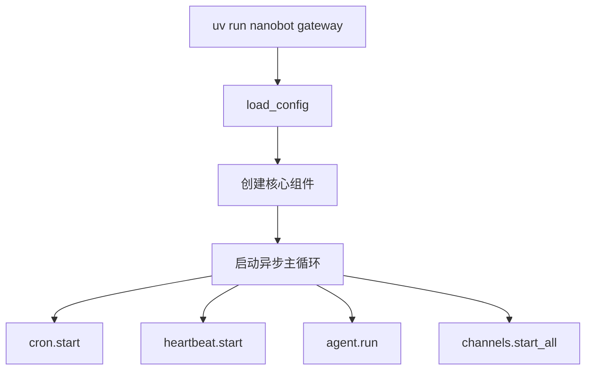
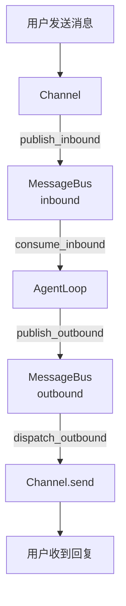

# Gateway 启动流程

> 执行 `nanobot gateway` 后程序的完整执行流程

---

## 一、命令入口

CLI 入口定义在 `pyproject.toml`:
```toml
[project.scripts]
nanobot = "nanobot.cli.commands:app"
```

使用 **typer** 框架实现 CLI，位于 `nanobot/cli/commands.py`。

---

## 二、启动流程



> 注: 核心组件包括 MessageBus, LLMProvider, SessionManager, CronService, HeartbeatService, AgentLoop, ChannelManager

---

## 三、并发运行的任务

### 1. CronService (定时任务)

位置: `nanobot/cron/service.py`

- 支持三种调度方式: `every N 秒`、`Cron 表达式`、`一次性执行`
- 定时任务触发时，向 MessageBus 发送消息

### 2. HeartbeatService (心跳服务)

位置: `nanobot/heartbeat/service.py`

- 周期性唤醒 Agent 检查任务
- 可配置触发间隔

### 3. AgentLoop.run() (消息处理)

位置: `nanobot/agent/loop.py`

```
while running:
  1. msg = await bus.consume_inbound()      # 消费入站消息
  2. session = sessions.get_or_create()     # 获取/创建会话
  3. messages = context.build_messages()   # 构建上下文
  4. response = _run_agent_loop(messages)  # LLM + Tools 循环
  5. session.save()                         # 保存会话
  6. await bus.publish_outbound(response)  # 发布响应
```

### 4. ChannelManager.start_all() (渠道启动)

位置: `nanobot/channels/manager.py`

- 根据配置启动所有已启用的渠道 (Telegram, Discord, WhatsApp, Feishu, etc.)
- 每个渠道独立运行，监听各自平台的 WebSocket/Webhook

---

## 四、消息流转



---

## 五、关键组件

| 组件 | 文件位置 | 职责 |
|------|----------|------|
| **MessageBus** | `nanobot/bus/queue.py` | 异步消息队列，解耦渠道与 Agent |
| **AgentLoop** | `nanobot/agent/loop.py` | 核心引擎: LLM 调用 + 工具执行 |
| **ChannelManager** | `nanobot/channels/manager.py` | 渠道生命周期管理 |
| **SessionManager** | `nanobot/session/manager.py` | 对话历史持久化 (JSONL) |
| **LLMProvider** | `nanobot/providers/` | LLM 调用封装 |
| **ToolRegistry** | `nanobot/agent/tools/registry.py` | 工具注册与执行 |

---

## 六、配置来源

配置按以下优先级加载:
1. 环境变量 (`NANOBOT_xxx`)
2. `~/.nanobot/config.json`
3. 默认值
